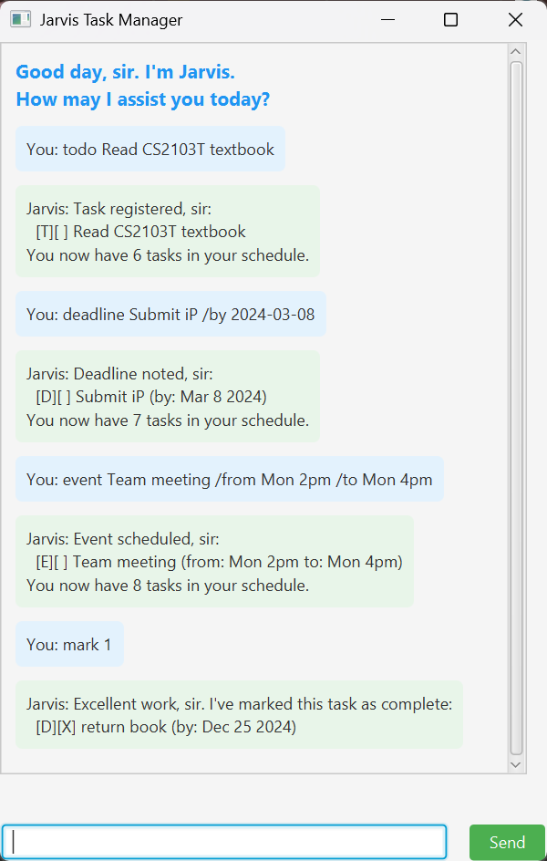

# Jarvis User Guide



Jarvis is a professional task management assistant with a polished graphical interface featuring color-coded messages and intuitive controls.

## Quick Start

1. Ensure you have Java 21 or above installed on your computer.
2. Download the latest `jarvis.jar` from the releases page.
3. Double-click the JAR file to launch, or run: `java -jar jarvis.jar`
4. Type commands in the text field and press Enter.

## Features

### Adding a Todo: `todo`
Adds a simple task without any date.

**Example:** `todo Read CS2103T textbook`
```
Got it. I've added this task:
  [T][ ] Read CS2103T textbook
Now you have 1 tasks in the list.
```

### Adding a Deadline: `deadline`
Adds a task with a deadline.

**Format:** `deadline DESCRIPTION /by DATE`

**Example:** `deadline Submit iP /by 2024-03-08`
```
Got it. I've added this task:
  [D][ ] Submit iP (by: Mar 8 2024)
Now you have 2 tasks in the list.
```

### Adding an Event: `event`
Adds an event with start and end times.

**Format:** `event DESCRIPTION /from START /to END`

**Example:** `event Team meeting /from Mon 2pm /to Mon 4pm`
```
Got it. I've added this task:
  [E][ ] Team meeting (from: Mon 2pm to: Mon 4pm)
Now you have 3 tasks in the list.
```

### Listing Tasks: `list`
Shows all your tasks.
```
Here are the tasks in your list:
1.[T][ ] Read CS2103T textbook
2.[D][ ] Submit iP (by: Mar 8 2024)
3.[E][ ] Team meeting (from: Mon 2pm to: Mon 4pm)
```

### Marking as Done: `mark`
Marks a task as complete.

**Example:** `mark 1`
```
Nice! I've marked this task as done:
  [T][X] Read CS2103T textbook
```

### Unmarking: `unmark`
Marks a task as not done.

**Example:** `unmark 1`

### Deleting: `delete`
Removes a task.

**Example:** `delete 1`

### Finding: `find`
Searches for tasks by keyword.

**Example:** `find book`

### Getting Motivation: `cheer`
Shows a random motivational quote.

### Exiting: `bye`
Closes the application.

## Command Summary

| Command | Format | Example |
|---------|--------|---------|
| Todo | `todo DESCRIPTION` | `todo Read book` |
| Deadline | `deadline DESC /by DATE` | `deadline Submit /by 2024-03-08` |
| Event | `event DESC /from START /to END` | `event Meeting /from 2pm /to 4pm` |
| List | `list` | `list` |
| Mark | `mark INDEX` | `mark 1` |
| Unmark | `unmark INDEX` | `unmark 1` |
| Delete | `delete INDEX` | `delete 1` |
| Find | `find KEYWORD` | `find book` |
| Cheer | `cheer` | `cheer` |
| Exit | `bye` | `bye` |